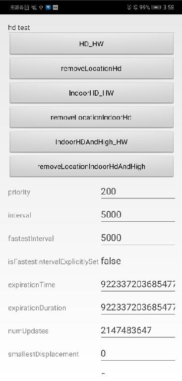

#  HMS Locationkit Demo for Android

English | [中文](https://github.com/HMS-Core/hms-location-demo-android-studio/blob/master/README_ZH.md)

## Table of Contents

 * [Introduction](#introduction)
 * [Getting Started](#getting-started)
 * [Installation](#installation)
 * [Supported Environments](#supported-environments)
 * [Sample Code](#sample-code)
 * [Result](#result)
 * [License](#license)
 
 
## Introduction
HUAWEI Location Kit sample code encapsulates APIs of the HUAWEI Location Kit. It provides many sample programs for your reference or usage.
   
## Getting Started
We also provide an sample to demonstrate the use of LocationKit SDK for Android.
This sample uses the Gradle build system.
First download the demo by cloning this repository or downloading an archived snapshot.
In Android Studio, use the "Open an existing Android Studio project", and select the directory of "locationkit-java-sample".
You can use the "gradlew build" command to build the project directly.
You should create an app in AppGallery Connect, and obtain the file of agconnect-services.json and add to the project. You should also generate a signing certificate fingerprint and add the certificate file to the project, and add configuration to build.gradle. See the Configuring App Information in AppGallery Connect guide to configure app in AppGallery Connect.

## Installation
 
1. Clone or download this project and open the downloaded folder in Android Studio or compatible IDE.
2. use IDE's functionality to install configured project on to your device.

## Supported Environments
   HMS Core (APK) 4.0.3 or later has been installed on Huawei Android phones.

## Sample Code
1. Invoke the addGeofence method of GeoFenceData to add a geo-fence. The code location is in the addGeofence method of the  src\main\java\com\huawei\hmssample2\geofence\GeoFenceActivity.java fle.
2. location broadcast receiver.The code is stored in src\main\java\com\huawei\hmssample2\location\fusedlocation\LocationBaseActivity.java

## Result
  

##  License
locationkit-java-sample is licensed under the [Apache License, version 2.0](http://www.apache.org/licenses/LICENSE-2.0).
