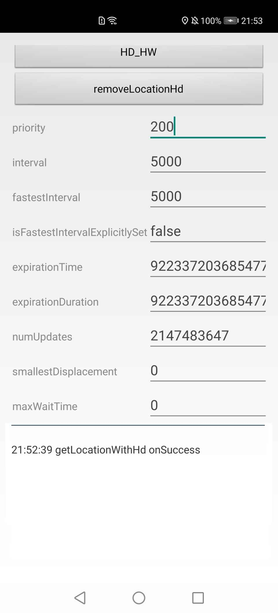

#  华为定位服务安卓版示例代码
中文 | [English](README.md)

## 目录
 * [简介](#简介)
 * [开发准备](#开发准备)
 * [安装](#安装)
 * [环境要求](#环境要求)
 * [结果](#结果)
 * [技术支持](#技术支持)
 * [授权许可](#授权许可)

## 简介
华为定位服务示例代码封装有华为定位服务的接口。 其提供许多示例程序供你参考或使用。
## 开发准备
我们还提供一个示例来展示如何使用安卓版定位服务SDK。 该示例使用Gradle编译系统。 首先通过克隆改仓库或者下载归档的快照来下载示例代码。 在Android Stuido中，选择Open an existing Android Studio project，然后选择示例文件所在的目录。 你可以使用gradlew build命令来直接编译项目。 你应该在AppGallery Connect中创建一个应用，获取agconnect-services.json文件并将其加入到你的项目中。 你还应生成一个签名证书指纹，将证书文件添加到你的项目中，并在build.gradle文件中添加配置。 参见“配置AppGallery Connect”在AppGallery Connect配置应用信息。
## 安装
1.	克隆或者下载该项目，在Android Studio或者兼容的IDE中打开下载的文件夹。
2.	使用IDE功能在你的设备上安装配置的项目。
## 环境要求
EMUI 5.0及以上的华为手机、华为平板或Android 5.1及以上的非华为手机。
## 结果
  

## 技术支持
如果您对HMS Core还处于评估阶段，可在[Reddit社区](https://www.reddit.com/r/HuaweiDevelopers/
)获取关于HMS Core的最新讯息，并与其他开发者交流见解。

如果您对使用HMS示例代码有疑问，请尝试：
- 开发过程遇到问题上[Stack Overflow](https://stackoverflow.com/questions/tagged/huawei-mobile-services?tab=Votes)，在`huawei-mobile-services`标签下提问，有华为研发专家在线一对一解决您的问题。
- 到[华为开发者论坛](https://developer.huawei.com/consumer/cn/forum/blockdisplay?fid=18) HMS Core板块与其他开发者进行交流。

如果您在尝试示例代码中遇到问题，请向仓库提交[issue](https://github.com/HMS-Core/hms-location-demo/issues)，也欢迎您提交[Pull Request](https://github.com/HMS-Core/hms-location-demo/pulls)。

## 授权许可
定位服务Java示例代码经过[Apache License 2.0](http://www.apache.org/licenses/LICENSE-2.0)授权许可。
