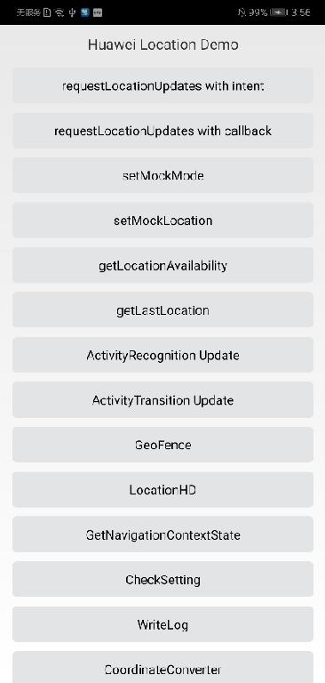

#  华为定位服务安卓版示例代码

## 目录
 * [开发准备](#开发准备)
 * [安装](#安装)
 * [环境要求](#环境要求)
 * [示例代码](#示例代码)
 * [结果](#结果)
 * [授权许可](#授权许可)
 
## 简介
华为定位服务示例代码封装有华为定位服务的接口。 其提供许多示例程序供你参考或使用。
## 开发准备
我们还提供一个示例来展示如何使用安卓版定位服务SDK。 该示例使用Gradle编译系统。 首先通过克隆改仓库或者下载归档的快照来下载示例代码。 在Android Stuido中，选择Open an existing Android Studio project，然后选择locationkit-java-sample文件所在的目录。 你可以使用gradlew build命令来直接编译项目。 你应该在AppGallery Connect中创建一个应用，获取agconnect-services.json文件并将其加入到你的项目中。 你还应生成一个签名证书指纹，将证书文件添加到你的项目中，并在build.gradle文件中添加配置。 参见“配置AppGallery Connect”在AppGallery Connect配置应用信息。
## 安装
1.	克隆或者下载该项目，在Android Studio或者兼容的IDE中打开下载的文件夹。
2.	使用IDE功能在你的设备上安装配置的项目。
## 环境要求
华为的Android手机上已安装HMS Core （APK）4.0.3或以上版本。
## 示例代码
1.	调用GeoFenceData的addGeofence方法添加地理围栏。 代码位置是在src\main\java\com\huawei\hmssample2\geofence\GeoFenceActivity.java文件中的addGeofence方法中。
2.	定位广播接收器。代码存储在src\main\java\com\huawei\hmssample2\location\fusedlocation\LocationBaseActivity.java文件中。
## 结果
 
   
## 授权许可
定位服务Java示例代码经过Apache License 2.0授权许可。

